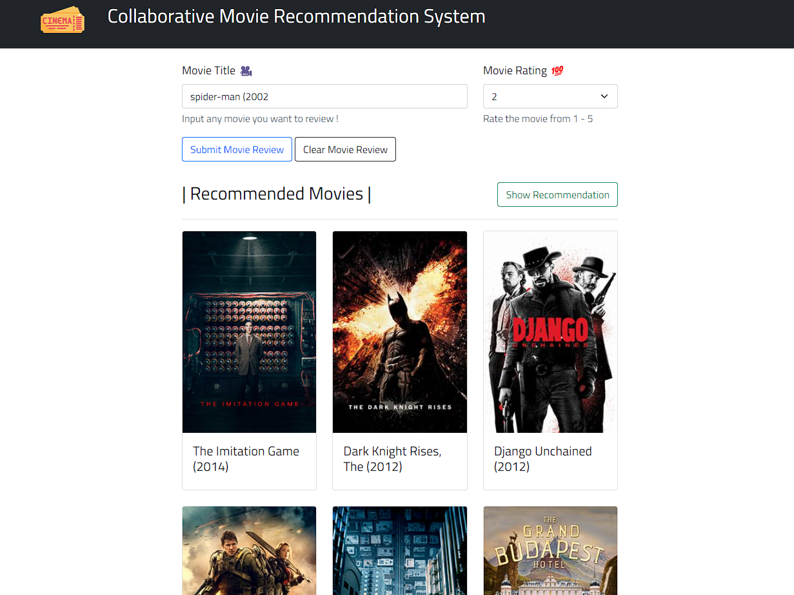

# MOVIE RECOMMENDATIONS SYSTEM USING COLLABORATIVE FILTERING



## About

A Collaborative Movie Recommendation System using a user movie-score dataset. The webapp is built using python flask framework and javascript

## Installation

### 1. Clone Repository

```cmd
git clone https://github.com/LeandroMartinMacato/minimax-tictactoe-flask
```

### 2. pip install requirements

```cmd
pip install -r requirements.txt
```

### 3. Run Flask Server

``` python
./app python app.py
```
